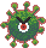
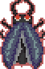
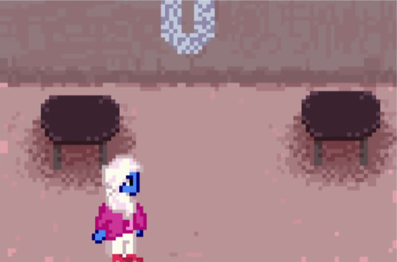
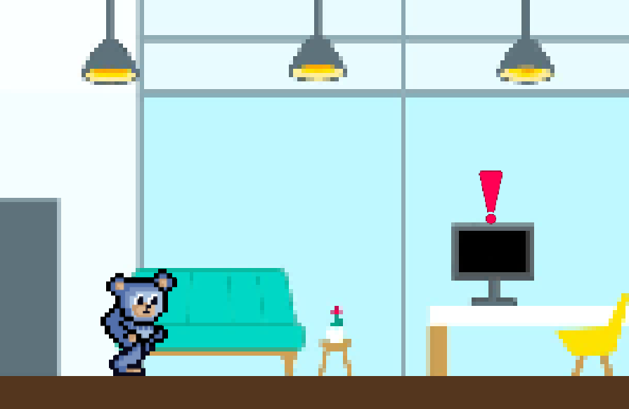

# GDD - Game Design Document - Módulo 1 - Inteli

## Pontual.org - UniLevel

#### Ana Beatriz Passos Beggiato
#### Eduardo Farias Rizk
#### Felipe de Melo Elgenneni
#### Fernanda Correia Nascimento
#### Lucas Guerra Vicente
#### Mariana Namie Guima
#### Pedro El Haouli Faria

## Sumário

[1. Introdução](#c1)

[2. Visão Geral do Jogo](#c2)

[3. Game Design](#c3)

[4. Desenvolvimento do jogo](#c4)

[5. Casos de Teste](#c5)

[6. Conclusões e trabalhos futuros](#c6)

[7. Referências](#c7)

[Anexos](#c8)

 

# 1. Introdução 
&nbsp;&nbsp;&nbsp;&nbsp;Este documento visa descrever todo o processo de desenvolvimento e implementação do jogo “UniLevel”, o qual foi desenvolvido por alunos do Instituto de Tecnologia e Liderança -  Inteli, em parceria com a Unilever, e busca proporcionar aos estudantes a oportunidade de aplicar seus aprendizados em um contexto real e, ao mesmo tempo, busca gamificar e dinamizar o processo de onboarding realizado na Unilever.

&nbsp;&nbsp;&nbsp;&nbsp;Ao longo deste documento, serão abordados tópicos fundamentais para o desenvolvimento e implementação do jogo, tais como o escopo geral do projeto, uma a análise geral de mercado da Unilever, a visão geral do jogo, o Game design, a descrição do processo de desenvolvimento e a documentação dos testes realizados.

## 1.1. Escopo do Projeto
&nbsp;&nbsp;&nbsp;&nbsp;O escopo do projeto abrange tópicos como contextualização da indústria, análise SWOT, descrição da solução desenvolvida, proposta de valor, matriz de risco e análise das forças de Porter - tópicos de suma importância para a compreensão tanto do contexto da empresa parceria, possibilitando um desenvolvimento de projeto que a atenda da melhor maneira possível, quanto do contexto mercadológico do jogo, demonstrando quais serão os pontos desenvolvidos a fim de agregar valor e credibilidade ao projeto.

### 1.1.1. Contexto da Indústria 

&nbsp;&nbsp;&nbsp;&nbsp;A indústria dos bens de consumo, uma das maiores do mundo, é responsável por cerca de 15% do faturamento industrial brasileiro 1, abrangendo desde alimentos até cuidados pessoais e limpeza, sendo “Unilever” 2, “Nestlé” 3, “Coca-Cola” 4 e “Procter & Gamble” 5 os principais players desse ramo - somando uma receita anual de aproximadamente 196,313 bilhões de reais, o equivalente a quase 10% do faturamento anual brasileiro 6. Essas empresas buscam a diferenciação de seus modelos de negócio por meio de publicidade e criação de novas experiências de uso para tentar atrair novos clientes 7, mas todas estão investindo em tecnologia de uma forma ou outra. No mais, as tendências entre essas multinacionais estão seguindo três pontos principais, sendo eles a personalização, a sustentabilidade e a inovação em seus produtos. Assim, por ser um mercado altamente competitivo, muitas empresas estão tentando se adaptar às novas demandas de mercado e consumo para manter sua posição e tentar ampliar suas atividades.

### 1.1.2. Análise SWOT 
&nbsp;&nbsp;&nbsp;&nbsp;Análise SWOT é uma ferramenta utilizada para avaliação de cenários antes do lançamento de um projeto 8, e sua utilização pode ser muito benéfica, principalmente, para uma tomada de decisão estratégicas com relação aos rumos do projeto, assim como para a obtenção de insights relacionados à solução dos possíveis problemas do projeto em questão. No mais, essa ferramenta permite a análise de fatores interno e externos, positivos e negativos, que impactam diretamente um projeto ou empresa, permitindo assim uma visão mais clara dos passos a serem tomados no desenvolvimento de um novo produto ou projeto.

Figura 1 - Análise SWOT 

Fonte: Material produzido pela Pontual.org (2024)

&nbsp;&nbsp;&nbsp;&nbsp;Conforme a análise SWOT, a Unilever traz forças como ser uma empresa global, ter grande influência nos mercados atuantes e boa imagem. Como fraquezas, temos mercados saturados, diversificação de produtos em áreas com alta inflação. Além disso, a demanda mundial por empresas sustentáveis e a participação da empresa globalmente abre um grande leque de oportunidades. Já as ameaças são o risco de imitação de produtos, flutuações cambiais e de mudanças regulatórias e preocupações ambientais, podendo impactar diretamente as operações e a reputação da empresa.

### 1.1.3. Descrição da Solução Desenvolvida 

&nbsp;&nbsp;&nbsp;&nbsp;Atualmente, a Unilever encontra-se no processo de estruturação de seu Onboarding para funcionários de TI recém-contratados, tendo como principal desafio o engajamento deles nesse processo, garantindo a absorção de todas as informações transmitidas. Dado que a empresa é adepta do modelo de trabalho HibridUS 9, uma necessidade pós pandêmica que proporciona aos funcionários maior tempo em contato com ferramentas tecnológicas, e que os novos colaboradores estão geralmente destinados às carreiras júnior - e, por isso, costumam ser mais jovens -, a solução proposta precisa abranger o ambiente web e não pode parecer infantil.

&nbsp;&nbsp;&nbsp;&nbsp;Diante desse cenário, a solução proposta consiste no desenvolvimento de uma aplicação interativa que proporcionará uma experiência envolvente na qual o colaborador, representado por um personagem virtual, navegará pelas instalações da empresa, desempenhando tarefas que têm como propósito transmitir de maneira eficaz os valores e missões da empresa, tal como demais informações cruciais presentes no processo de integração. Podendo ser acessado pelo próprio colaborador em seu notebook de trabalho, o jogo deve ser iniciado após o processo geral de Onboarding da empresa, para que o funcionário passe a ter contato com as informações específicas de sua área - como explicações sobre determinados vocabulários e processos.

&nbsp;&nbsp;&nbsp;&nbsp;Através da utilização desta aplicação, será possível não só motivar o funcionário a realizar o Onboarding, mas também garantir que ele tenha acesso a todas as informações necessárias para integrar-se na empresa. No mais, a organização poderá verificar a realização ou não do processo, assim como o nível de absorção das informações por parte do novo colaborador.

&nbsp;&nbsp;&nbsp;&nbsp;Ademais, visando mensurar o sucesso da aplicação, será utilizado o nível de aceitação dos funcionários quanto a ferramenta, assim como a eficácia dela no que tange a realização do processo de Onboarding e a absorção das informações nele transmitidas.

### 1.1.4. Proposta de Valor 

&nbsp;&nbsp;&nbsp;&nbsp;Um Canvas de Proposta de Valor é definido visando visualizar, projetar e testar a criação de valor da empresa para o cliente 10. Assim, foi desenvolvido para o jogo em questão o seguinte Canvas de Proposta de Valor:

Figura 2 - Proposta de Valor 

Fonte: Material produzido pela Pontual.org (2024)

&nbsp;&nbsp;&nbsp;&nbsp;Por meio da imagem acima, observa-se que a maior dor do cliente está relacionada ao seu processo de Onboarding, que precisa transmitir muitas informações, mas não consegue fazê-lo de forma atrativa para os funcionários. Por isso, o principal “analgésico” proposto é o desenvolvimento de um jogo que permita à empresa oferecer um processo de Onboarding gamificado, garantindo assim uma atratividade maior e, consequentemente, uma maior absorção de informações por parte dos funcionários, permitindo com que estejam integrados e produtivos desde seu primeiro contato com a empresa.

### 1.1.5. Matriz de Riscos 

&nbsp;&nbsp;&nbsp;&nbsp;Pensando na gestão de crise e risco, foi desenvolvida para esse jogo uma Matriz de Probabilidade e Impacto, a qual tem como principal objetivo a identificação prévia de possíveis riscos e oportunidades do projeto, permitindo um planejamento prévio das ações a serem tomadas na ocorrência desses eventos.

Figura 3 - Matriz de risco 

Fonte: Material produzido pela Pontual.org (2024)

Diante disso, com a Matriz realizada, faz-se necessário traçar uma análise dos impactos e possíveis planos de ação para cada risco identificado. Abaixo, observa-se essa análise:

- **Queda de energia na empresa no momento da realização do jogo:** esse é um risco de baixa probabilidade e baixo impacto, visto que o prédio sede da empresa tem gerador de energia 11 e, além disso, o jogo pode ser acessado pelos celulares dos funcionários através do navegador. 
- **Falta de informações disponíveis para o desenvolvimento do jogo:** esse é um risco de baixa probabilidade - visto que os desenvolvedores já possuem a maioria das informações necessárias para o desenvolvimento do game -, mas que tem um médio impacto no jogo, dado que a indisponibilidade de informações relacionadas ao onboarding da empresa leva o jogo a não cumprir plenamente seu objetivo. Diante disso, é função do grupo 
- **Má interpretação, por parte dos funcionários, das informações fornecidas no game:** esse é um risco de média probabilidade, dado que o desenvolvimento do jogo visa apresentação clara das informações. Entretanto, a efetivação desse risco teria um alto impacto para o jogo, visto que sua principal funcionalidade é exatamente essa: transmitir as informações sobre a empresa com clareza.
- **Ocorrência de bugs no jogo:** esse é um risco de baixa probabilidade - em função da realização de diferentes testes antes do lançamento do game -, mas de alto impacto, já que impediria a experiência plena do usuário para com o jogo. Assim, efetivando-se a ocorrência de bugs, é função dos programadores aumentar os casos de teste, visando identificar e corrigir todas as intercorrências de funcionamento do jogo. 
- **Queda do servidor responsável pela hospedagem do game:** esse é um risco de baixa probabilidade, em função da estabilidade dos servidores web já consolidados, mas de muito alto impacto, visto que a queda de servidor representa, ao jogo, sua indisponibilidade momentânea. Assim, ocorrendo uma queda de servidor, será necessária a emissão, na página do game, de um aviso de indisponibilidade momentânea, visando deixar o usuário ciente de que precisará tentar acessar o site em outro momento.
- **Perda dos arquivos de desenvolvimento do jogo:** esse é um risco de baixa probabilidade, porque o grupo usa plataformas web para desenvolvimento e, além disso, armazena muitos arquivos em nuvem com backup diário. Entretanto, uma perda de arquivos teria um impacto muito alto no projeto, já que pode representar a perda, também, do jogo. Por isso, é dever do grupo manter seus backups diários e, em caso de perda de um ou vários arquivos, buscar por restaurar a versão imediatamente anterior do jogo, minimizando assim os prejuízos de desenvolvimento.
- **Maior prestígio do processo de onboarding da Unilever:** essa é uma oportunidade com alta probabilidade de acontecimento, visto que o onboarding da empresa já é muito bem avaliado 12, e sua gamificação apenas traria ainda mais prestígio. Ainda, essa é uma oportunidade de alto impacto no jogo, visto que o prestígio da empresa seria, também, direcionado ao jogo, possibilitando sua aplicação em outros setores e empresas. A fim de garantir esse aumento de prestígio, é dever da equipe de marketing do jogo divulgar não só sua funcionalidade, mas também sua aplicabilidade e funcionalidade.
- **Metaverso como plataforma para ampliar a experiência imersiva do jogo:** essa é uma oportunidade de alta probabilidade e alto impacto, visto que o metaverso tem se desenvolvido cada vez mais rápido 13, e tem elevado potencial para aumentar a imersividade e interatividade da maioria das práticas digitais, como no game em questão. Assim, para efetivar a ocorrência de tal fato, será dever da equipe de TI adaptar o jogo ao ambiente do metaverso assim que ele estiver disponível e acessível para todos os usuários da internet.

### 1.1.6. Análise das 5 forças de Porter 
&nbsp;&nbsp;&nbsp;&nbsp;A análise das 5 forças de Proter é uma framework de anpalise setorial desenvolvido pelo economista Michael Porter, e a função dessa ferramenta é permitir o entendimento do nível de competitividade de um mercado. Esse modelo utiliza de cinco atores principais: concorrentes, fornecedores, clientes, novos entrantes e substitutos; considerando esses atores, a ferramenta análisa como eles se relacionam e qual a sua influência no sucesso do negócio ou projeto. 

#### 1.1.6.1 - Forças de Porter em relação à empresa

&nbsp;&nbsp;&nbsp;&nbsp;A análise das Cinco Forças de Porter é importante para entender o ambiente competitivo em que a Unilever opera, visto que essa análise considera todos os fatores que podem influenciar o desempenho de uma empresa no mercado. Vamos explorar as cinco forças:

- **Rivalidade entre concorrentes**: A indústria de bens de consumo é pautada por alta competitividade, com várias empresas globais competindo por participação de mercado. A Unilever enfrenta concorrentes como Procter & Gamble, Nestlé e Colgate-Palmolive.

- **Ameaça de novos entrantes**: no setor atuante da empresa, a entrada de novos concorrentes no setor é moderada. Barreiras incluem economias de escala, distribuição global e forte presença de marcas estabelecidas.

- **Poder de barganha dos fornecedores**: A Unilever se conecta com muitos fornecedores de matérias-primas. O poder de barganha dos fornecedores é moderado, mas a empresa mantém relacionamentos estratégicos para garantir fontes confiáveis de materiais.

- **Poder de barganha dos compradores**: os compradores têm várias opções devido à alta rivalidade. A Unilever deve manter preços competitivos e inovar para atender às demandas dos clientes e ganhar sua atenção e preferência.

- **Ameaça de produtos substitutos**: os produtos de consumo têm muitos substitutos. A Unilever deve continuar inovando e oferecendo valor superior para evitar que os consumidores mudem para outras marcas ou categorias.

#### 1.1.6.2 - Forças de Porter em relação ao jogo

&nbsp;&nbsp;&nbsp;&nbsp;Além da análise das cinco forças de Porter da Unilever, é igualmente importante fazer essa análise direcionada para a empresa que está desenvolvendo o jogo, a fim de entender qual é o seu potencial de desempenho no mercado em que pretende se inserir. Abaixo, segue a análise das cinco forças de Porter da Pontual.org, responsável pelo desenvolvimento do jogo Unilevel:

- **Ameaça de novos concorrentes**: nosso ambiente é altamente competitivo, apresentando jogos ótimos e completos, com grande capacidade de competitividade. Por outro lado, levando em consideração o mercado geral de jogos, a qualidade das pesquisas relacionadas ao nosso projeto, público-alvo, branding, análises de mercado, entre outras, diminuem tremendamente a ameaça externa.

-**Ameaça de produtos substitutos**: no cenário atual, levando em consideração a plataforma escolhida, o tempo de desenvolvimento e os conhecimentos adquiridos através das pesquisas para a construção de um jogo dedicado, não há probabilidade de ameaça de outros produtos.

- **Poder de barganha dos fornecedores:** A Pontual.org se conecta com diversas ferramentas, tanto em design quanto código, garantindo diversas fontes de instrumentos, porém a base do projeto se concentra em uma única ferramenta de jogo, causando uma dependência moderada ao fornecedor.

- **Poder de barganha dos compradores (jogadores)**: Os compradores têm algumas outras opções de produtos devido à alta competitividade, portanto a Pontual.org mantendo-se com uma boa jogabilidade que agrada desde os jogadores natos até os iniciantes pode manter-se bem colocado no mercado, além de atender expectativas como suporte ao cliente em possíveis mudanças, originalidade, criatividade e ideias autorais.

- **Rivalidade entre os concorrentes**: os jogos têm muitos substitutos, cada um com a sua característica e jogabilidade, portanto, novamente, a equipe deve focar na sua originalidade e qualidade nas informações passadas, trabalhos realizados e ideias produzidas.

## 1.2. Requisitos do Projeto

&nbsp;&nbsp;&nbsp;&nbsp;A definição de requisitos de um projeto é feita a fim de trazer mais clareza para a definição de objetivos e escopo, assim como nortear o planejamento de desenvolvimento do produto em questão. Aqui, são considerados os pontos considerados essenciais pelo cliente, sendo esses requisitos o ponto de partida para o planejamento e execução do projeto. No caso do jogo em questão, os requisitos foram retirados do kickoff com o cliente e listados na tabela abaixo.

Tabela 1 - Requisitos do Projeto
\# | Requisito  
--- | ---
1 | Apresentar a organização e divisão da área de IT
2 | Apresentação do mundo Unilever (informações públicas da empresa)
3 | Apresentar o que é UniOps
4 | Ambientação web
5 | Ser uma trilha indidvidual
6 | Metrificar a absorção do conteúdo por parte do jogador
7 | Colher feedback sobre o conteúdo do game
8 | Ser um HUB de links
9 | Incluir checkpoints
10 | Ter uma página ou fase de tutorial
11 | Ter interação com NPCs
12 | Resolução de tarefas ao longo do jogo

Fonte: Material produzido pela Pontual.org (2024)

## 1.3. Público-alvo do Projeto 

&nbsp;&nbsp;&nbsp;&nbsp;Traçar o público-alvo de qualquer produto a ser lançado é de suma importância para seu desenvolvimento, visto que possibilita uma visão mais clara dos requisitos do projeto, assim como possibilita uma maior aceitação dos usuários para com o produto, já que ele foi pensado para esse público. Quando se tratando de um jogo que será utilizado no processo de Onboarding de uma empresa, faz-se necessário entender não só o nível de instrução dos funcionários dessa empresa que utilizarão o jogo, mas também sua idade e sua experiência prévia com jogos.

Figura 4 - Público Alvo em ampla análise 

Fontes: LinkedIn da Unilever e questionário enviado para a Unilever.

Figura 5 - Público Alvo em menor espaço amostral 

Fontes: LinkedIn da Unilever e questionário enviado para a Unilever.

&nbsp;&nbsp;&nbsp;&nbsp;Diante de uma análise de público-alvo realizada por meio da análise do LinkedIn 14 da Unilever e de uma pesquisa de campo feita por um grupo parceiro (GreenTech), chegou-se à conclusão de que o jogo não precisa ser projetado especificamente para pessoas que nunca jogaram, pois a maioria dos entrevistados já tem experiência com jogos, variando de títulos simples a jogos como Call of Duty. Isso simplifica o desenvolvimento do jogo, permitindo que aspectos básicos, como movimentação e interação com bots, sejam intuitivos para os jogadores. No mais, ficou constatado que os potenciais usuários do game são residentes principalmente no México, Espanha e Argentina, além do Brasil, o que nos leva à necessidade de desenvolver o jogo em línguas latinas ou no inglês (língua universal), e a faixa etária dos jogadores gira em torno dos 30 a 40 anos.

Figura 6 - Template de Persona 

Fontes: LinkedIn da Unilever e questionário enviado para a Unilever.

# 2. Visão Geral do Jogo 
&nbsp;&nbsp;&nbsp;&nbsp;No jogo "Unilevel", a história central gira em torno de um hackeamento da Unilever, ou seja, um hacker invadiu o sistema da Unilever e roubou suas marcas. Já no momento inicial do jogo, esse contexto é apresentado ao player, dizendo a ele que para recuperar as marcas será necessário o desbloqueio de uma senha - o que poderá ser feito respondendo perguntas, as quais desbloqueiam parte de uma senha quando respondidas corretamente. Para viver essa aventura, o player é "abduzido" para o interior do computador, passando por fases de um jogo de plataforma temáticas das marcas que precisam ser salvas, e ao final de cada fase o jogador encontrará links de treinamentos, os quais o condicionarão a responder o quizz que virá a seguir. Assim, observa-se que o jogo mistura o mundo lúdico com as atividades reais do trabalhador, trazendo assim mais leveza no seu processo de onboarding.

## 2.1. Objetivos do Jogo 

&nbsp;&nbsp;&nbsp;&nbsp;No que tange o enredo do jogo, seu objetivo central do é resgatar as marcas da Unilever do controle de um Hacker que invadiu o seu sistema. Para isso, o jogador precisa terminar as fases respondendo a um quizz, que lhe concederá parte de uma palavra-chave para desativar o sistema do hacker. Tendo isso em mente, o game tem como objetivo metodológico tornar o processo de Onboarding uma experiência leve e divertida para os novos funcionários da Unilever por meio da mescla entre o mundo virtual, representado pelo o jogo em si, e o mundo real, representado pelos treinamentos de capacitação concedidos ao player para que ele responda ao quizz, o qual terá perguntas relacionadas aos conteúdos desses treinamentos.

## 2.2. Características do Jogo 
&nbsp;&nbsp;&nbsp;&nbsp;Nesta seção, serão discutidas as características gerais do jogo, ou seja, os pontos que tornam "Unilevel" um jogo único. Para tal, serão abordados pontos como gênero, plataforma, número de jogadores, inspirações e tempo de jogo - tópicos responsáveis por tornar a experiência de jogo única, além de unificar a existência do jogo Unilevel, ou seja, são essas as características que tornam o jogo único.

### 2.2.1. Gênero do Jogo 

&nbsp;&nbsp;&nbsp;&nbsp;Pensando em criar um jogo que se encaixe aos gostos de seu público alvo, ou seja, aos novos funcionários da Unilever, foi criado um formulário com as opções de preferências por diferentes gêneros de jogos. 

Figura 7 - Preferência de gênero de jogo 

Fontes: Material desenvolvido pela Pontual.org (2024)

Segundo as respostas recebidas, grande parte dos dados coletados indicou uma tendência à escolha de games de ação e aventura e, por conta disso, foi desenvolvido um jogo que mistura a fantasia das marcas da Unilever com a aventura de resgatá-las de um hacker. 
  
### 2.2.2. Plataforma do Jogo 

&nbsp;&nbsp;&nbsp;&nbsp;A plataforma de um jogo é o local ou servidor em que o game é carregado e exibido aos jogadores; assim, ele pode ser rodado em desktops, mobiles, etc. Por conta dos requisitos propostos pelo cliente, o jogo desenvolvido rodará na Web de dispositivos desktop. 

### 2.2.3. Número de jogadores 

&nbsp;&nbsp;&nbsp;&nbsp;A fim de facilitar o controle de dados da progressão de cada participante no Onboarding, o jogo apresentará somente um jogador, visto que isso otimiza a interação dele com os conteúdos e links da Unilever. Além disso, uma trilha individual permite uma melhor análise do aproveitamento do conteúdo por parte do jogador.

### 2.2.4. Títulos semelhantes e inspirações 

&nbsp;&nbsp;&nbsp;&nbsp;O jogo se inspirou em "Super Mario Bros.", uma vez que utilizou a dinâmica de plataformas e inimigos para que o player encontre desafios. Além disso, durante a progressão do jogo, aparecem em certas fases objetos que causam danos aos personagens de diversas formas, como encostando nele ou caindo sobre ele. Ademais, há um quiz no final da fase inspirado em "Trivia Quest", jogo da Netflix, sendo utilizado para testar os conhecimentos do jogador sobre a Unilever, assim como computar o seu aprendizado por um sistema de pontuações. 

### 2.2.5. Tempo estimado de jogo 

&nbsp;&nbsp;&nbsp;&nbsp;Visto que o percurso durante as fases do jogo dura cerca de 5 minutos e o jogo possui três fases, uma introdutória e duas jogáveis, de cerca de 2 minutos, conclui-se que o jogo tem uma duração de cerca de quinze minutos. Entretanto, esse tempo pode variar em função da necessidade de leitura dos links disponibilizados durante o jogo, sendo esse tempo de leitura relativo a cada usuário e à extensão do conteúdo abordado.

# 3. Game Design

&nbsp;&nbsp;&nbsp;&nbsp;O design de um jogo desempenha um papel fundamental em sua concepção, fornecendo a base sobre como a experiência interativa é construída. Por isso, nesta seção do documento, será feita uma abordagem mais profunda da essência do jogo, trazendo seus aspectos que o tornam único. Para tal, será abordado o processo criativo e de desenvolvimento do jogo, passando por tópicos como enredo, personagens, mundo, inventário, bestiário, gameflow, resgras e mecânicas do jogo. 

## 3.1. Enredo do Jogo 

&nbsp;&nbsp;&nbsp;&nbsp;A primeira cena do jogo UniLevel é ambientada na casa do personagem controlável, o Ursinho Fofo, que anda até o computador posicionado na mesa do seu escritório e encontra nele uma notificação pop-up. Nessa notificação, um hacker descreve seu plano de tomar a Unilever para si, roubando as marcas e mantendo-as em um cativeiro protegido por senha. Em função disso, o jogador fica encarregado de salvar cada uma das marcas por meio da obtenção das letras da senha, e para isso é teletransportado por meio de um portal mágico para dentro do próprio computador.

&nbsp;&nbsp;&nbsp;&nbsp;Após isso, o personagem é teletransportado, encontrando o primeiro cenário: O Mundo OMO, um espaço azul com plataformas de pregador de roupa e máquinas de lavar, diversas bolhas de sabão e roupas penduradas em todo canto. Seu primeiro objetivo é passar pelas bactérias das roupas sujas e alcançar o celular, NPC onipresente guia de jornada responsável por mostrar o caminho de acesso às informações (link) que o jogador precisará para desbloquear no qual estará disponível um link de conteúdo. Seguindo em frente, o jogador encontrará um novo portal mágico que o levará para uma tela de quizz, na qual serão testados seus conhecimentos sobre os conteúdos disponibilizados nos links. Ao fim dessa fase, ao acertar a pergunta, o jogador libera o NPC da Omo e é encaminhado para a próxima fase.

&nbsp;&nbsp;&nbsp;&nbsp;Seguindo pelo portal, o jogador vai para o próximo cenário: A Floresta da Mãe Terra, um mundo repleto de árvores e plantações, porém infestado com besouros que comem os biscoitos naturais que brotam da terra. Seguindo por plataformas desses mesmos comestíveis e suas embalagens, o jogador alcança o celular novamente, recebendo outro link e mais uma pergunta, que, ao ser respondida corretamente, liberta a segunda parte da senha e o Jacaré Zooreta. Com o acerto do segundo quizz, o jogador encerra o game e salva a Unilever do hackeamento.

## 3.2. Personagens 

&nbsp;&nbsp;&nbsp;&nbsp;Os personagens de um jogo são fundamentais para a criação de sua narrativa, interatividade e imersividade. Para isso, os personagens costumam ser divididos em dois tipos: jogáveis e não jogáveis(NPCs). Enquanto os jogáveis são os personagens que podem ser controlados pelo jogador, ou seja, são os personagens que o jogador utiliza para avançar no jogo, os NPCs são personagens não jogáveis, e sua função está geralmente relacionada à transmissão de contextos e informações ao longo do jogo, além de proporcionar maior interatividade no mundo de jogo. 

&nbsp;&nbsp;&nbsp;&nbsp;O jogo UniLevel conta com um personagem jogável (o qual pode ser de quatro coresd diferentes, a depender da escolha do jogador) e três NPCS, cujas funções são variadas e apresentadas abaixo.

### 3.2.1. Controláveis

&nbsp;&nbsp;&nbsp;&nbsp;Os personagens são modelos em pixel art baseados no Ursinho Fofo, mascote embaixador da marca de amaciantes Fofo da Unilever. Os controláveis homônimos seguem a mesma paleta de cores do rebranding divulgado em 2023, sendo quatro opções de escolha: azul, bege, rosa-vermelho e laranja-roxo. Seu design é baseado primariamente nos sprites do Megaman 1987, da Capcom para o Nintendo Entertainment System.

&nbsp;&nbsp;&nbsp;&nbsp;Os objetivos delegados ao personagem vão desde a leitura dos documentos e acesso dos links enviados pela Unilever até a resposta de perguntas relacionadas a esses conteúdos, desbloqueando letras de uma palavra-chave a ser utilizada para salvar os NPC-marcas do ataque de hackers. Durante a realização de tarefas, o jogador consegue mover a persona para frente, para trás e pular em um modelo plataforma de mundo. Além disso, tendo em vista que, apesar de estar preso em um mundo virtual, o controlável é uma personificação do funcionário de TI, foi acordado pela equipe de não incluir habilidades sobre-humanas ou de luta. 

### 3.2.2. Non-Playable Characters (NPC)

&nbsp;&nbsp;&nbsp;&nbsp;Ao longo do jogo, existem três tipos de NPCs: O hacker, vilão principal do jogo que aparece por meio de mensagens no computador do personagem controlável, as próprias marcas a serem salvas e os inimigos de cada nível. Cada um deles segue a paleta de cores especificada no Kit Media enviado pela Unilever ou a cor padrão dos produtos já existentes e também se comportam como modelos em pixel art.

&nbsp;&nbsp;&nbsp;&nbsp;O hacker não apresenta características físicas e se comporta apenas como pop-ups no computador do personagem. 

&nbsp;&nbsp;&nbsp;&nbsp;Os NPCs-marcas são os que apresentam características mais diversas, sendo:
* OMO: O NPC da marca é uma caixa de sabão em pó que comporta o branding antigo da marca (anos 2000), metade do corpo dividido em tons de vermelho e azul vibrantes com pontos de luz brancos no centro.
* Mãe Terra: O NPC da marca é o jacaré da linha alimentícia Zooreta, a versão escolhida foi a paleta de cores do salgadinho assado de queijo, contando com uma blusa branca, casaco laranja e calça azul com detalhes em amarelo.

&nbsp;&nbsp;&nbsp;&nbsp;Da mesma forma, cada nível apresenta seus respectivos capangas, NPCs cujo objetivo é atrapalhar a passagem de fase, assim, eles se comportam como:
* OMO: Os NPCs capangas da marca são bactérias das roupas sujas que atacam o jogador, fazendo-o voltar para o início da fase e dificultando seus avanços. Elas seguem uma paleta de cores voltada para o rosa e fímbrias (protuberâncias) amareladas, contrastando com o tom azulado do background.
* Mãe Terra: Os NPCs capangas da marca são besouros que atacam o jogador. Eles comportam cores mais escuras voltadas para o marrom e o preto. Contrastando com o verde do background folhado.

### 3.2.3. Diversidade e Representatividade dos Personagens

&nbsp;&nbsp;&nbsp;&nbsp;No jogo UniLevel, os personagens foram criados propositalmente com aparências não humanoides, inspirando-se nos mascotes de diversas marcas da Unilever. Essa escolha abrange uma ampla gama de seres, desde jacarés até ursos e embalagens, evitando estereótipos ligados a qualquer etnia ou cultura específica. Essa abordagem tem um efeito inclusivo e universalizador, pois ao optar por personagens que não remetem a nenhum grupo humano em particular, o jogo consegue representar a todos. Essa estratégia assegura que os jogadores de diferentes background possam se engajar com o jogo sem se sentirem excluídos ou estereotipados, promovendo uma experiência de jogo acolhedora e acessível. Sendo muito importante em um país com uma cultura tão diversificada quanto a do Brasil o jogo ter características não esteriotipadas.

&nbsp;&nbsp;&nbsp;&nbsp;Em resumo, a escolha de personagens não humanos é uma jogada que amplia o alcance do jogo, tornando-o acessível e atraente para um público-alvo quase ilimitado. Isso não só maximiza o potencial de engajamento dos jogadores, mas também fortalece sua posição como uma experiência inclusiva e engajadora que se preocupa com a diversidade e a inclusão.

## 3.3. Mundo do jogo 

&nbsp;&nbsp;&nbsp;&nbsp;O mundo dentro de um jogo refere-se ao ambiente fictício onde a narrativa se desenvolve, atuando como o pano de fundo para a ação e aventura. Esse cenário pode variar amplamente, desde representações realistas do dia a dia até criações fantásticas e totalmente imaginárias. No caso do jogo Unilevel, ocorre uma interessante fusão entre o real e o imaginário: a cena de abertura se passa em um ambiente que remete ao mundo real, mas conforme o jogador avança, as fases se desdobram em um universo ricamente fantasioso. Em sua essência, Unilevel é ancorado em um contexto lúdico, com uma estética visual marcada pela pixel art, oferecendo uma experiência visualmente única e envolvente.
### 3.3.1. Locações Principais e/ou Mapas 

&nbsp;&nbsp;&nbsp;&nbsp;O jogo ocorre em um cenário lúdico, o qual representa a temática de um dos produtos da Unilever em cada fase.  Abaixo, segue uma tabela com as fases e seus respectivos temas: 

Tabela 2 - Planejamento das fases 

|Fase|Marca| Background | Plataforma | Inimigo| 
|--------|---------|-----------------------| ------ | ---| 
|1|Introdução| Escritório da Unilever | Computador hackeado| Não há | 
|2|Omo| Parede com bolhas de sabão na área inferior e roupas penduradas na parte superior| Pregadores de roupa, máquina de lavar e cesto de roupas| Bactéria | 
|3|Mãe Terra| Fundo de floresta | Biscoito e pacote de bolacha | Besouro| 

Fonte: Material produzido pela Pontual.org (2024)

### 3.3.2. Navegação pelo mundo 

&nbsp;&nbsp;&nbsp;&nbsp;O jogo, uma plataforma inspirada na dinâmica de "Super Mario Bros." de 1986, começa com o jogador sendo abduzido por um computador invadido por um hacker que sequestra os produtos da Unilever. Ao ser teletransportado para a próxima fase, o jogador assume a responsabilidade de resgatar uma das marcas e encontrar a personagem não jogável (NPC) YoUni, que entregará ao jogador um link para o Onboarding da Unilever.
&nbsp;&nbsp;&nbsp;&nbsp;Após isso, o jogador continua até o final da fase e encontra um quiz que testa o conteúdo aprendido. Se acertar, recebe uma pontuação, uma letra-chave essencial para desativar o sistema do invasor na última fase e a permissão para atravessar o portal que leva à próxima fase. Por outro lado, se errar, deve responder à mesma questão até acertar, com a pontuação da questão diminuindo a cada erro. Essa dinâmica se repete em todas as fases, mudando apenas a marca a ser resgatada.

### 3.3.3. Condições climáticas e temporais 

&nbsp;&nbsp;&nbsp;&nbsp;Condições climáticas e temporais não se aplicam ao jogo, visto que ele ocorre em um mundo fantasioso dentro de um computador, onde as condições climáticas não existem e não afetam a progressão na fase. Além disso, o jogo não apresenta um tempo limitado para sua conclusão; apenas registra o tempo de jogo para que a empresa possa monitorar o tempo de aprendizado do jogador.

### 3.3.4. Concept Art 

&nbsp;&nbsp;&nbsp;&nbsp;Para a tela de início, pensamos em fazer "Easter eggs", ou seja, referências das próximas cenas do jogo e dos produtos da Unilever; a fim de apresentar a estética do game. A seguir, pode-se observar a concept art inicial e a sua paleta de cores 15: 

Figura 8 - Concept art da cena 0 

Fonte: Material produzido pela Pontual.org (2024)

Figura 9 - Paleta de cores da cena 0 

Fonte: Material produzido pela Pontual.org (2024)

&nbsp;&nbsp;&nbsp;&nbsp;Já para a primeira fase, pensamos em representar o escritório da Unilever com cores saturadas e vibrantes, onde o player encontrará o computador hackeado e será teletransportado para a dimensão dos produtos da Unilever. 

Figura 10 - Concept art da cena 1 

Fonte: Material produzido pela Pontual.org (2024)

Figura 11 - Paleta de cores da cena 1 

Fonte: Material produzido pela Pontual.org (2024)

&nbsp;&nbsp;&nbsp;&nbsp;Para a segunda fase, criamos um background inspirado em uma lavanderia com roupas penduradas e sabão espalhado pelo chão, a fim de condizer com a "Omo". Além disso, desenhamos pregadores e máquinas de lavar como plataformas dentro dessa mesma temática e uma bactéria que representa o inimigo. Também foi criado um NPC de uma caixa da Omo para que ele seja salvo durante a cena pelo player. 

Figura 12 - Concept art da cena 2 

Fonte: Material produzido pela Pontual.org (2024)

Figura 13 - Paleta de cores da cena 2 

Fonte: Material produzido pela Pontual.org (2024)

Figura 14 - Concept art do Omo 

Fonte: Material produzido pela Pontual.org (2024)

Figura 15 - Paleta de cores da Omo 

Fonte: Material produzido pela Pontual.org (2024)

&nbsp;&nbsp;&nbsp;&nbsp;Em relação à terceira fase, criamos um campo aberto com uma árvore que simboliza a logo da "Mãe Terra" e algumas plantas, as quais também são apresentadas em várias embalagens da marca. Para representar a marca a ser resgatada, optamos por um jacaré que figura em alguns pacotes de biscoito. Por fim, projetamos as plataformas em forma de bolachas e pacotes de biscoito para fazer referência a alguns produtos e escolhemos um besouro como inimigo.

Figura 16 - Concept art da cena 3 

Fonte: Material produzido pela Pontual.org (2024)

Figura 17 - Paleta de cores da cena 3 

Fonte: Material produzido pela Pontual.org (2024)

Figura 18 - Concept art do Jacaré Zooreta da Mãe Terra 

Fonte: Material produzido pela Pontual.org (2024)

Figura 19 - Paleta de cores do Jacaré Zooreta da Mãe Terra 

Fonte: Material produzido pela Pontual.org (2024)

&nbsp;&nbsp;&nbsp;&nbsp;Caso o player tenha colidido com algum inimigo durante a partida, ele será transferido para a tela de "game over", onde ele terá que reiniciar a fase; não sendo necessário começar o jogo desde a cena inicial do escritório da Unilever. 

Figura 20 - Concept art da cena game over 

Fonte: Material produzido pela Pontual.org (2024)

Figura 21 - Paleta de cores da cena game over 

Fonte: Material produzido pela Pontual.org (2024)

### 3.3.5. Trilha sonora

&nbsp;&nbsp;&nbsp;&nbsp;A trilha sonora é de suma importância para aprimorar a experiência do usuário, visto que exerce impacto emocional e contribui para a imersão. Dessa forma, ela é responsável pela "suspensão da descrença", momento em que, aos olhos do espectador, a fantasia parece real, permitindo seu total envolvimento com a narrativa e, consequentemente, enriquecendo sua experiência.

&nbsp;&nbsp;&nbsp;&nbsp;No jogo em desenvolvimento, a trilha sonora foi pensada não só como indicativo, como na coleta de moedas ou no fim de jogo, mas também para criar uma ambientação que ofereça ao jogador um ambiente de jogo calmo, ou seja, sem muita pressão, e, ao mesmo tempo, nostálgico, dado que as trilhas sonoras de jogos arcade costumam remeter muito ao jogo "Super Mario Bros.".

Figura 22 - Paleta de cores da cena game over 

\# | título | ocorrência | autoria
--- | --- | --- | ---
1 | Kaze no Tani no Naushika | Tela de início | Makiko Hirohashi
2 |  Umi No Mieru Machi | Cena das plataformas | Makiko Hirohashi
3 | Kahoot Soundtrack | Tela de perguntas | Kahoot

Fonte: Material produzido pela Pontual.org (2024)

## 3.4. Inventário e Bestiário

### 3.4.1. Inventário

&nbsp;&nbsp;&nbsp;&nbsp;Inventário é um componente do jogo acessível em qualquer momento dele, e serve como uma "mochila" para guardar itens coletados pelo jogador que terão alguma utilidade futura no jogo. No caso do jogo desenvolvido, o inventário tem como função principal o armazenamento dos links disponibilizados ao player, os quais contém as informações necessárias não só para resolução das perguntas do quizz final, mas também informações importantes para sua integração plena na empresa. Além disso, o inventário do jogo armazenará as moedas coletadas, cuja principal função e guiar o jogador pelo mapa.

\# | item |  | como obter | função | efeito sonoro
--- | --- | --- | --- | --- | ---
1 | Moeda |  | Espalhadas em todas as fases, coletavel pelo jogador | Guia o jogador | Som de moeda
2 | Link | | um NPC concederá os links no decorrer das fases | Direcionar o usuário para páginas externas de treinamento | Não possui 

### 3.4.2. Bestiário

&nbsp;&nbsp;&nbsp;&nbsp;Bestiário, no contexto em questão, vai ser uma área de definição das criaturas (inimigos) a serem enfrentadas no jogo. Esses inimigos têm como principal função criar mais dificuldade e trazer um maior dinamismo ao jogo, evitando com isso que ele fique monótono. Diante disso, o jogo Unilevel possui como inimigos uma bactéria e um besouro, os quais estão presentes nas fases um e dois, respectivamente, e estão espalhados pelo caminho para trazer mais desafio ao jogador.

\# | inimigo |  | ocorrências | função | impacto | efeito sonoro
--- | --- | --- | --- | --- | --- | ---
1 | Bactéria |  | Fase 1, OMO | Anda, saltitando e com velocidade constante | Se encostar no inimigo o personagem perde 1 ponto de vida | Não possui 
2 | Besouro |  | Fase 2, Mãe Terra | Fica pulando no mesmo local | Se encostar, o personagem perde 1 ponto de vida | Não possui 

## 3.5. Gameflow (Diagrama de cenas) 

&nbsp;&nbsp;&nbsp;&nbsp;O "GameFlow" ou "Diagrama de Cenas" de um jogo é uma representação visual de todas as classes, atributos e métodos de cada cena do jogo, e permite maior compreensão sobre as dinâmicas, as funcionalidades e os "caminhos" possíveis em cada momento do jogo.

Figura 23 - Diagrama de cenas

Fonte: Material produzido pela Pontual.org (2024)

-**Tela inicial:** o jogador começa o jogo aqui, e basta clicar na tela para que o jogo se inicie. Para o desenvolvimento desta tela, foram colocadas referências à todas as fases do jogo, como sorvete, máquina de lavar, entre outros. Para a programação desta tela, a única classe utilizada até então foi a classe "Scene00", a qual ainda não tem atributos próprios e apresenta <code>create()</code> como único método. No mais, essa classe apresenta como única herança o atributo <code>Phaser.scenes()</code>

-**Fase 1:** pensada para ser uma introdução à dinâmica do jogo, essa fase apresenta um cenário inicial de escritório no qual o personagem principal anda por ele, aprendendo os movimentos, e encontra o "computador hackeado" no qual iniciará sua imersão no game. Por ser uma fase de tutorial, ela não apresenta possibilidade de GameOver, sendo exclusivamente uma introdução às mecânicas e dinâmicas do jogo. Para o desenvolvimento dessa fase, a única classe utilizada até então foi a "Scene01", que não tem atributos próprios e apresenta <code>preload()</code>, <code>create()</code> e <code>update()</code> como métodos. No mais, essa classe apresenta como única herança o atributo <code>Phaser.scenes()</code>

-**Fase 2:** temática da marca "Omo", essa fase será de plataforma, e além de responder o quiz do final, o jogador deve atravessar o cenário sem encostar na bactéria - inimigo cuja colisão com o player leva ao GameOver, trazendo a necessidade de reiniciar a fase (e não o game). Para o desenvolvimento dessa fase, a única classe utilizada até então foi a "Scene02", que não tem atributos próprios e apresenta <code>preload()</code>, <code>create()</code> e <code>update()</code> como métodos. No mais, essa classe apresenta como única herança o atributo <code>Phaser.scenes()</code>

-**Fase 3:** temática da marca "Mãe Terra", essa fase também será de plataforma, e além de responder o quiz do final, o jogador deve atravessar o cenário sem encostar no besouro - inimigo cuja colisão com o player leva ao GameOver, trazendo a necessidade de reiniciar a fase (e não o game). O desenvolvimento dessa fase ainda não foi iniciado, mas deve seguir o padrão de programação das demais e, portanto, a única classe utilizada (inicialmente) será a "Scene03", que não tem atributos próprios e apresenta <code>preload()</code>, <code>create()</code> e <code>update()</code> como métodos. No mais, essa classe apresenta como única herança o atributo <code>Phaser.scenes()</code>

-**Tela Final:** projetada para ser o encerramento do jogo, esta tela apresentará o tempo levado pelo player no jogo, assim como a pontuação conquistada por ele nas respostas aos quizzes. Como se trata de uma tela de encerramento, as únicas possibilidades para o jogador dentro dela são a de sair do jogo ou a de jogar novamente. O desenvolvimento desta tela ainda não foi iniciado, mas deve seguir o padrão de programação das demais e, portanto, a única classe utilizada (inicialmente) será a "Scene08", que não tem atributos próprios e apresenta <code>preload()</code>, <code>create()</code> e <code>update()</code> como métodos. No mais, essa classe apresenta como única herança o atributo <code>Phaser.scenes()</code>

-**Tela GameOver:** essa é a tela que o jogador verá ao encostar em um inimigo, ou seja, quando perder o jogo. Visto que na concepção do jogo os autores decidiram por não possibilitar o retorno a fases anteriores, a tela de GameOver tem como única possibilidade o reinício da fase que foi perdida, e não permite o reinício do jogo inteiro. O desenvolvimento desta tela ainda não foi iniciado, mas deve seguir o padrão de programação das demais e, portanto, a única classe utilizada (inicialmente) será a "Scene08", que não tem atributos próprios e apresenta <code>preload()</code>, <code>create()</code> e <code>update()</code> como métodos. No mais, essa classe apresenta como única herança o atributo <code>Phaser.scenes()</code>

## 3.6. Regras do jogo 

&nbsp;&nbsp;&nbsp;&nbsp; O jogador deve subir nas plataformas, desviar dos inimigos e de buracos no chão visando resgatar a marca temática da presente fase em que ele está. O jogador terá três vidas por fase, caso ele caia nas fendas ou colida com inimigos, uma vida será perdida e ele somente voltará para o início da fase se perder todas as vidas. Para passar para a próxima cena, o player deve responder corretamente um quiz referente ao conteúdo aprendido no link e guardar a letra-chave no seu inventário após acertar a pergunta. Abaixo, segue uma tabela com as pontuações recebidas pelas respostas corretas:  

Tabela 3 - Pontuação por tentativas de resposta

|Tentativas até acertar a questão| Pontuação recebida| 
|---|---| 
|1| 4| 
|2 | 2| 
|3 | 1| 
|4 | 0| 

Fonte: Material produzido pela Pontual.org (2024)

Ao passar para a próxima fase do jogo, o player não poderá retornar a elas, já que eles poderiam responder às questões novamente e mudar a sua pontuação final, que representa o seu nível de aproveitamento do Onboarding. Entretanto, ele terá acesso ao conteúdo do Onboarding ao acessar os links que serão incorporados ao seu inventário a cada fase passada. Após terminar todas as fases, o player deve acessar o computador e digitar as letras-chave para bloquear o sistema do hacker. 

## 3.7. Mecânicas do jogo

&nbsp;&nbsp;&nbsp;&nbsp;O jogo ocorre em plataforma e o jogador pode ser controlado pelas setas "direita", "esquerda" e "cima" do teclado, que fazem o player se movimentar para frente, para trás e pular, respectivamente. Para interagir com NPC's e responder os quizes, deve-se clicar nos referidos com o mouse. Além disso, o player pode saltar nas plataformas, que estão flutuando durante as fases, e deverá fugir dos inimigos, os quais farão o jogador ser transferido à tela de game over e voltar para o início da fase caso eles colidam. Na fase da Kibon a dinâmica do inimigo será diferente, já que ele imitará uma cobertura de sorvete pingando; entretanto, a regra de game over também será válida para essa cena.  Ademais, na fase da "Dove" haverá um desodorante que empurrará o player para a frente por meio de um jato constante, que o deslocará no eixo x para a direita. Por fim, na fase da "Knorr" o jogador deverá pressionar a tecla "espaço" a fim de fazer seu personagem voar, já que essa fase segue a mesma dinâmica de "Flappy Bird".

# 4. Desenvolvimento do Jogo

&nbsp;&nbsp;&nbsp;&nbsp;Nesta seção será documentado o processo de desenolvimento do jogo ao longo de 10 semanas, sendo essa documentação descrita quinzenalmente de acordo com as entregas parciais do jogo (sprints), sendo a primeira quinzena o desenvolvimento preliminar, a segunda o desenvolvimento básico, a terceira o desenvolvimento intermediário, a quarta o desenolvimento final e, por fim, a quinta destinada à revisão e definição de passos futuros. Em cada uma das seções de desenvolvimento, existe uma separação entre o que foi feito, quais foram os desafios e quais são os próximos passos, a fim de facilitar a visualização e compreensão do processo de desenvolvimento do projeto.

## 4.1. Desenvolvimento preliminar do jogo

### 4.1.1 O que fizemos
&nbsp;&nbsp;&nbsp;&nbsp;Até o momento, nosso grupo se dedicou ao desenvolvimento do personagem do jogo, o que incluiu a definição da estética desejada e a criação de imagens para animação em diferentes ângulos: de frente, lado e de costas. Em termos de programação, implementamos a movimentação do personagem, permitindo-o mover-se para frente, para trás e para os lados. Além disso, integramos o cenário ao jogo e adicionamos a animação, que consiste em alterar a imagem do personagem conforme ele se move em diferentes direções. Adicionalmente, garantimos que a movimentação do personagem respeite os limites do cenário.

### 4.1.2 Desafios
&nbsp;&nbsp;&nbsp;&nbsp;Durante o desenvolvimento dessa primeira sprint tivemos dificuldades com a sintaxe do JavaScript, uma vez que diversos erros ocorreram devido à ausência de vírgulas e à escrita errada de palavras. 
Também ocorreram empecilhos em relação à animação do personagem, já que tivemos que utilizar uma spritesheet piloto que não possuía todos os sprites; contudo, conseguimos escrever a programação básica da animação, a qual pode ser facilmente editada quando a spritesheet oficial for finalizada. Além disso, a criação da animação da posição de costas do player causou complicações, visto que o jogo travava quando a tecla "cima" era pressionada, ou seja, quando o personagem virava de costas. Entretanto, isso foi consertado a partir da revisão gramatical da função “this.anims.create”.

### 4.1.3 O que precisamos fazer
&nbsp;&nbsp;&nbsp;&nbsp;Nossos próximos passos para o jogo envolvem aprimorar o cenário, pois o atual limita bastante a experiência de jogo, já que o personagem ocupa uma grande parte da tela. Isso incluiria a criação de novas estruturas e objetos que o personagem poderia interagir e aprimorar. Além disso, é crucial desenvolvermos cenas, o que significa que o jogo teria uma tela inicial onde ao pressionar uma tecla, iniciaria e mudaria de cena.

&nbsp;&nbsp;&nbsp;&nbsp;Em relação ao personagem, decidimos que seria mais harmonioso se a câmera do jogo acompanhasse seus movimentos, o que contribuiria para a fluidez da jogabilidade.

## 4.2. Desenvolvimento básico do jogo 

### 4.2.1 O que fizemos
Semana 1-2 (Jogo Isométrico):
- Durante as primeiras duas semanas, o jogo estava sendo desenvolvido como um jogo isométrico.
- Criação de assets isométricos, design de níveis e sistemas de jogo específicos para esse formato.
- A mudança de cenas foi programada nesse espaço de tempo
- Tela de início

Figura 24 - Tela de início anterior
  
  Fonte: Material produzido pela Pontual.org
 (2024)

Figura 25 - Tela de início atual
  
Fonte: Material produzido pela Pontual.org (2024)

Semana 3 (Transição para um “platformer”):
- Mudança do time de programação (Mariana e Eduardo → Felipe e Lucas)
- mudança no paradigma, jogo isométrico, para um jogo “platformer” 2D
- implicou ajustes significativos nos assets, design de níveis, mecânicas de jogo e código
- compreensão do código antigo para tentar aproveitar o máximo durante essa transição
- início da cena 1 (início do jogo)

   Problema no Código de Digitação (Dias 1-4 da Semana 3):
    - Um erro de digitação acabou por atrasar a produção
    - Houve consideração para uma reescrita completa do código, mas isso foi evitado após a resolução do problema
   Programação Fluída (Após Resolução do Problema):
    - a programação do jogo ocorreu de forma fluida após esse ocorrido
    - início da implementação das mecânicas básicas
    - O desenvolvimento se concentrou em implementar as mecânicas de “platformer” 2D, ajustar a física do jogo e integrar os novos assets
Semana 4
- finalização da implementação das mecânicas básicas
- finalização da cena 1
- comentários no código
- revisão do código
- início da cena 2 (Fase da Omo)
- Entregáveis da Versão Básica:

Figura 26 - Entregáveis da versão básica
   
Fonte: Material produzido pela Pontual.org (2024)

Uma versão básica do jogo foi entregue com os seguintes elementos:
- Mecânicas de “platformer” 2D funcionais
- Carregamento adequado de assets
- Design de níveis adaptado ao novo formato
- Correções de bugs relacionados à transição

### 4.2.2 Desafios
- O principal desafio foi o problema no código de digitação que afetou o carregamento de imagens
- A transição rápida de um estilo de jogo para outro pode ter causado algumas complicações iniciais na integração dos sistemas

### 4.2.3 O que precisamos fazer
- aprimorar as mecânicas e adicionar novas
- Realizar testes para identificar e corrigir possíveis bugs
- Adicionar novas fases 

## 4.3. Desenvolvimento intermediário do jogo

### 4.3.1 O que fizemos
&nbsp;&nbsp;&nbsp;&nbsp;O desenvolvimento da versão intermediária do jogo se deu com a elaboração do level design da cena 02 (fase da OMO) e a programação desta, adicionando ao jogo: plataformas, inimigos, recursos visuais do tipo affordance - que melhoram a jogabilidade e a tornam mais intuitiva - e a transição para a próxima fase, feita por meio de um portal no final do mapa. Ademais, foi desenvolvida uma nova tela inicial e um botão funcional para interagir com o game, juntamente com a tela de GameOver quando o player cai um espaço sem chão ou quando encosta em um dos inimigos. Em conclusão, essa sprint entrega a primeira fase jogável com desafios e conquistas, uma jogabilidade mais intuitiva e coerente com a proposta e uma prévia da próxima tela, a fase da Mãe Terra. 

&nbsp;&nbsp;&nbsp;&nbsp;Em termos de código, foram excluídas as variáveis vazias, adicionadas novas funções de colisão, transição de telas e interatividade - o uso dos botões -, e incluídos novos testes de gravidade, diâmetro de pulo e variações de tamanho dos personagens. 

### 4.3.2 Desafios
&nbsp;&nbsp;&nbsp;&nbsp;As próximas dificuldades estão em: manter a jogabilidade fluida e em um nível coerente de esforço do player, implementar as falas nas linhas de texto e garantir o entendimento total da proposta de cada fase. Pensando em mitigar esses problemas, os próximos passos se concentram em aumentar os casos de teste - sobretudo com pessoas que não jogam com frequência - para garantir a adequação dos padrões de habilidades e aumentar o time de programação para tornar o desenvolvimento mais ágil.

Figura 27 - Nova tela de início com botão funcional

Fonte: Material produzido pela Pontual.org (2024)

Figura 28 - Nova tela de GameOver

Fonte: Material produzido pela Pontual.org (2024)

Figura 29 - Funções de colisão que permitem o personagem subir e se manter 

Fonte: Material produzido pela Pontual.org (2024)

Figura 30 - Prévia da fase: Mãe Terra, acessada por um portal na fase OMO 

Fonte: Material produzido pela Pontual.org (2024)

### 4.3.3 O que precisamos fazer
&nbsp;&nbsp;&nbsp;&nbsp;Nossos próximos passos envolvem a implementação da próxima fase, a criação de uma tela de HUD com as vidas e moedas e a implementação dos quizzes, nos NPCs e do sistema de disponibilização de links.

## 4.4. Desenvolvimento final do MVP

### 4.4.1 O que fizemos

&nbsp;&nbsp;&nbsp;&nbsp;Primeiramente, adicionamos a tela de escolha dos personagens, os quais estão com todas as spritesheets dinâmicas e estáticas funcionando. 

Figura 31 - Tela de escolha do personagem

Fonte: Material produzido pela Pontual.org (2024)

&nbsp;&nbsp;&nbsp;&nbsp;Além disso, as falas de contextualização do hacker foram adicionadas no balão de fala, que atualiza o seu conteúdo quando o jogador pressiona a tecla "F". A partir dessa sprint, o personagem pode ser movimentado por meio das teclas "WASD".

Figura 32 - Tela da cena do escritório com as falas do hacker

Fonte: Material produzido pela Pontual.org (2024)

&nbsp;&nbsp;&nbsp;&nbsp;Nessa sprint, nós adicionamos checkpoints representados por bandeiras para que o jogador não tenha que recomeçar a fase inteira caso encoste no inimigo ou caia em um buraco. Complementando essa ideia, foi implementada a HUD de vidas, que aparece no canto superior esquerdo da tela e indica quantas vidas o jogador ainda tem antes de sofrer "GameOver". Também criamos moedas ao decorrer da fase, a fim de tornar o caminho a ser percorrido pelo jogador mais claro. 

Figura 33 - Checkpoint e HUD de vidas

Fonte: Material produzido pela Pontual.org (2024)

&nbsp;&nbsp;&nbsp;&nbsp;Ademais, o HUD com os links que redirecionam o player para os conteúdos da Unilever foi implementado. A tela de quiz foi implementada com a mudança de perguntas a cada fase concluída e o sistema de pontos e as chave-senha UNIOPS foram adicionados quando o player acerta a pergunta.  

Figura 34 - Tela do quiz

Fonte: Material produzido pela Pontual.org (2024)

Figura 35 - Tela de acerto com a pontuação e parte da chave UNIOPS

Fonte: Material produzido pela Pontual.org (2024)

&nbsp;&nbsp;&nbsp;&nbsp;Ademais, implementamos a fase da Mãe Terra, que conta com a paralaxe do background, plataformas e inimigos. Por fim, sons e a transição de telas com fade in e fade out foram criados. 

Figura 36 - Fase da Mãe Terra

Fonte: Material produzido pela Pontual.org (2024)

&nbsp;&nbsp;&nbsp;&nbsp;Por fim, criamos uma tela de fechamento que parabeniza o jogador por concluir o game e indica a chave completa para desligar o sistema do hacker.

Figura 37 - Tela final

Fonte: Material produzido pela Pontual.org (2024)

### 4.4.2 Desafios
&nbsp;&nbsp;&nbsp;&nbsp;Nessa sprint, o tempo e a quantidade de tarefas a serem realizadas foram um desafio, já que tivemos que implementar diversas funções novas em uma sprint que foi mais curta. Além disso, houve problemas de comunicação em relação aos commits, o que levou à sobrescrita de códigos e ao aumento de conflitos de merges. 

### 4.4.3 O que precisamos fazer
&nbsp;&nbsp;&nbsp;&nbsp;Na próxima sprint, nós adicionaremos mais sons e mais telas de quizz para aumentar os conteúdos a serem validados pelo player. Além disso, planejamos implementar um contador de moedas coletadas e affordances nos botões interativos do teclado (teclas "F" e "E").

## 4.5. Revisão do MVP 
Durante a última sprint, realizamos uma análise do MVP com o intuito de procurar áreas que poderiam ser melhoradas. Aprimoramos nosso produto a cada sprint, identificando e implementando melhorias. Entretanto, por conta do tempo que teríamos para realizar tais mudanças, tivemos que priorizar algumas alterações e deixar outras para os próximos passos. Este texto detalha as mudanças da última sprint e as próximas etapas.

### 4.5.1 O que fizemos
Primeiramente, focamos na contextualização do jogo. Percebemos que as cutscenes poderiam ser mais envolventes e coerentes com a narrativa do jogo. Trabalhamos para melhorar a qualidade e a fluidez dessas cenas, tornando-as mais imersivas para os jogadores.

Figura 38 - cutscene

Fonte: Material produzido pela Pontual.org (2024)

Em seguida, voltamos nossa atenção para os assets desatualizados. Identificamos vários elementos gráficos que precisavam ser atualizados para melhorar a estética geral do jogo. Implementamos novos designs e gráficos para esses assets.

Figura 39 - fase Mãe Terra antiga

Fonte: Material produzido pela Pontual.org (2024)

Figura 40 - fase Mãe Terra nova

Fonte: Material produzido pela Pontual.org (2024)

Também nos deparamos com alguns bugs que afetavam a jogabilidade, sendo eles na movimentação, sistema de vida e em poucos botões (que não reagiam da forma esperada). Nossa equipe trabalhou incansavelmente para corrigir esses problemas, garantindo uma experiência de jogo suave e sem interrupções.

A acessibilidade sonora foi outra área que exigiu nossa atenção. Reconhecemos a importância de tornar nosso jogo acessível a todos os jogadores, incluindo aqueles com deficiências auditivas. Portanto, implementamos legendas e descrições sonoras para garantir que todos possam desfrutar do jogo. 

Figura 41 - acessibilidade sonora

Fonte: Material produzido pela Pontual.org (2024)

### 4.5.2 Desafios
No entanto, é importante ressaltar que, devido à limitação de tempo, tivemos que tomar decisões difíceis sobre quais mudanças poderiam ser implementadas agora e quais teriam que ser adiadas para os próximos passos. Assim, embora tenhamos uma visão clara das melhorias que queremos trazer para o nosso jogo, a restrição de tempo significa que algumas dessas mudanças terão que esperar até as próximas sprints. Isso não diminui a importância dessas melhorias adiadas, mas sim destaca o desafio contínuo de equilibrar as demandas do desenvolvimento do produto com o tempo disponível.

### 4.5.3 Passos futuros
Um problema a ser resolvido a seguir é a fonte de texto. Percebemos que a fonte atual pode ser difícil de ler para alguns jogadores. Planejamos pesquisar e implementar uma fonte mais legível no futuro. 
Além disso, decidimos adicionar mais cutscenes para melhorar a narrativa do jogo. Acreditamos que isso ajudará a aprofundar a conexão dos jogadores com a história e os personagens. No entanto, devido à complexidade de criar cutscenes de alta qualidade, decidimos deixar essa tarefa para as próximas etapas do projeto.

# 5. Testes 

## 5.1. Casos de Teste

&nbsp;&nbsp;&nbsp;&nbsp;A elaboração de casos de teste é essencial para a verificação completa da funcionalidade de um jogo, garantindo que todos os seus aspectos operem conforme esperado. Esses casos são meticulosamente projetados com base no código do jogo, detalhando o comportamento antecipado para cada situação específica. Para o jogo Unilevel, os seguintes casos de teste foram meticulosamente elaborados:

\# | pré-condição | descrição do teste | pós-condição 
--- | --- | --- | --- 
1 | --- | o jogo começar do início | o jogo deve iniciar na cena 00
2 | Cena 00 | Clicar no botão esquerdo do mouse | mudar para a cena 01
3 | Cena 01 | Clicar na seta esquerda | O player se move para a esquerda
4 | Cena 01 | Clicar na seta direita | O player se move para a direita
5 | Cena 01 | Clicar na seta de cima | O player pula
6 |Cena 01| Clicar na tecla F | muda as falas do hacker
7 | Cena 01 | Colidir com o player na área do Ponto de Exclamação e apertar E| mudar para a cena 02
8 | Cena 02 | Apertar E após colidir com o celular| Abrir o HUB de links
9 | Cena 02 | Reponder o questionário | Liberar o portal e passar para próxima fase7
10 | Cena 02 | Apertar E após colidir com o celular| Abrir o HUB de links
11 | Cena 02 | Reponder o questionário | Liberar o portal e passar para próxima fase

 

## 5.2. Testes de jogabilidade (playtests) 

&nbsp;&nbsp;&nbsp;&nbsp;Testes de jogabilidade são realizados com diversos jogadores que sigam o perfil do público-alvo, e sua importância está relacionada com a garantia de que o jogo atinge seu objetivo e pode ser plenamente utilizado pelos jogadores. Aqui, são analisados pontos como intuitividade dos comandos, jogabilidade, funcionamento das cenas e outros fatores importantes para que o jogador avance sem problemas pelo game.

### 5.2.1 Registros de testes

Tabela de testes - Testador 01

Nome | Jorge silva
--- | ---
Já possuía experiência prévia com games? | Sim, é um jogador casual
Conseguiu iniciar o jogo? | Sim.
Entendeu as regras e mecânicas do jogo? |Entendeu as mecânicas, mas teve leves dificuldades para identificar que o inimigo não poderia ser derrotado e pulou na cabeça dele
Conseguiu progredir no jogo? | Sim, sem dificuldades  
Apresentou dificuldades? | Sim, com o inimigo que não conseguiu identificar que não poderia derrotá-lo
Que nota deu ao jogo? | 7.0
O que gostou no jogo? | Gostou dos gráficos e da arte
O que poderia melhorar no jogo? | Aumentar a gravidade

Fonte: Material produzido pela Pontual.org (2024)

Tabela de testes - Testador 02

Nome | Andrea Eisenhower
--- | ---
Já possuía experiência prévia com games? | Sim, é um jogador casual
Conseguiu iniciar o jogo? | Sim
Entendeu as regras e mecânicas do jogo? |Entendeu as mecânicas, mas teve leves dificuldades para entender as regras
Conseguiu progredir no jogo? | Sim, sem dificuldades  
Apresentou dificuldades? | Sim, na página inicial teve dificuldades para entender ao certo no que deveria clicar para o jogo iniciar
Que nota deu ao jogo? | 8.0
O que gostou no jogo? | Gostou da estética do game
O que poderia melhorar no jogo? | Valor da gravidade, contextualização da cena inicial e tempo de pulo.

Fonte: Material produzido pela Pontual.org (2024)

Tabela de testes - Testador 03

Nome | Ludmila Leitnerová
--- | ---
Já possuía experiência prévia com games? | Sim, é um jogador casual
Conseguiu iniciar o jogo? | Sim
Entendeu as regras e mecânicas do jogo? |Entendeu as mecânicas, mas teve leves dificuldades para entender as regras
Conseguiu progredir no jogo? | Sim, sem dificuldades  
Apresentou dificuldades? | Sim, na página inicial teve dificuldades para entender ao certo no que deveria clicar para o jogo iniciar
Que nota deu ao jogo? | 7.0
O que gostou no jogo? | Gostou da estética do game
O que poderia melhorar no jogo? | Valor da gravidade e tempo de pulo.

Fonte: Material produzido pela Pontual.org (2024)

Tabela de testes - Testador 04

Nome | Nicolash Costa
--- | ---
Já possuía experiência prévia com games? | Não, quase não possui experiência com games
Conseguiu iniciar o jogo? | Sim
Entendeu as regras e mecânicas do jogo? |Não conseguiu entender as regras, mas conseguiu entender as dinâmicas por meio de tentativas, pela falta de uma explicação detalhada da dinâmica do jogo.
Conseguiu progredir no jogo? | Sim
Apresentou dificuldades? | Sim, apresentou dificuldades para passar do inimigo.
Que nota deu ao jogo? | 8.5
O que gostou no jogo? | Arte
O que poderia melhorar no jogo? | Gravidade e fluidez dos movimentos da personagem.

Fonte: Material produzido pela Pontual.org (2024)

Tabela de testes - Testador 05

Nome | Tânia Rodrigues
--- | ---
Já possuía experiência prévia com games? | Sim
Conseguiu iniciar o jogo? | Sim
Entendeu as regras e mecânicas do jogo? |Regras não, mecânica sim
Conseguiu progredir no jogo? | Sim
Apresentou dificuldades? | Sim, não entendeu aonde clicar para começar e não entendeu que a bactéria era um inimigo até morrer para ela
Que nota deu ao jogo? | 9
O que gostou no jogo? | Arte
O que poderia melhorar no jogo? | Gravidade e affordance da bactéria como inimigo

Fonte: Material produzido pela Pontual.org (2024)

Tabela de testes - Testador 06

Nome | Eduardo Castro
--- | ---
Já possuía experiência prévia com games? | Sim, é um jogador casual
Conseguiu iniciar o jogo? | Sim
Entendeu as regras e mecânicas do jogo? |Entendeu as mecânicas, mas teve leves dificuldades para identificar que o inimigo não poderia ser derrotado e pulou na cabeça dele
Conseguiu progredir no jogo? | Sim, sem dificuldades
Apresentou dificuldades? | Não
Que nota deu ao jogo? | 8.5
O que gostou no jogo? | Ele gostou das artes e da movimentação
O que poderia melhorar no jogo? | Poderia ter um aviso mostrando que não poderia encostar no inimigo.

Fonte: Material produzido pela Pontual.org (2024)

Tabela de testes - Testador 07

Nome | Rafaela Cavalcanti
--- | ---
Já possuía experiência prévia com games? | Sim, é um jogador casual
Conseguiu iniciar o jogo? | Sim
Entendeu as regras e mecânicas do jogo? |Entendeu as mecânicas, mas teve leves dificuldades para entender as regras
Conseguiu progredir no jogo? | Sim, sem dificuldades
Apresentou dificuldades? | Não, conseguiu jogar com facilidade e afirmou ser fácil
Que nota deu ao jogo? | 9
O que gostou no jogo? | 
O que poderia melhorar no jogo? | A responsividade do personagem aos controles, disse que havia um pouco de atraso desde o momento do comando até a resposta do personagem.

Fonte: Material produzido pela Pontual.org (2024)

Tabela de testes - Testador 08

Nome | Giovanni Mendes
--- | ---
Já possuía experiência prévia com games? | Sim, é um jogador assíduo.
Conseguiu iniciar o jogo? | Sim.
Entendeu as regras e mecânicas do jogo? |Sim, mas apresentou um pouco de dificuldade com a tecla E (utilizada no início do jogo para inicializar a fase 1).
Conseguiu progredir no jogo? | Sim, sem dificuldades.
Apresentou dificuldades? | Apenas a da tecla E inicial. 
Que nota deu ao jogo? | 10
O que gostou no jogo? | Afirmou que o jogo roda liso, elogiou a temática e gostou bastante da escolha de cores.
O que poderia melhorar no jogo? | Apenas colocar mais obstáculos e inimigos.

Fonte: Material produzido pela Pontual.org (2024)

Tabela de testes - Testador 09

Nome | Eduardo Rossi
--- | ---
Já possuía experiência prévia com games? | Sim, mas afirma que atualmente joga em momentos raros.
Conseguiu iniciar o jogo? | Sim
Entendeu as regras e mecânicas do jogo? |Sim
Conseguiu progredir no jogo? | Sim, mas encontrou algumas dificuldades para superar os obstáculos e inimigos na primeira fase.
Apresentou dificuldades? | Sim, teve dificuldades com o pulo, já que para pular e avançar é necessário o uso de duas teclas (seta para cima e seta para a direita). 
Que nota deu ao jogo? | 10
O que gostou no jogo? | Gostou da sensação de nostalgia oferecida pelo jogo, e também elogiou o personagem principal, que tem aparência "muito simpática".
O que poderia melhorar no jogo? | Como o jogador utiliza suporte ergonômico para o notebook, o que deixa o teclado na vertical, sugeriu que o jogo tenha um aviso de que a experiência de jogo é muito melhor com o teclado na horizontal.

Fonte: Material produzido pela Pontual.org (2024)

Tabela de testes - Testador 10

Nome | Danilo Nakagomi
--- | ---
Já possuía experiência prévia com games? | Sim, jogava antigamente.
Conseguiu iniciar o jogo? | Sim
Entendeu as regras e mecânicas do jogo? |Sim, mas ficou com dúvida quanto a encostar ou não no inimigo, visto que essa é uma mecânica muito associada a Mario, no qual o player precisar "matar" os inimigos.
Conseguiu progredir no jogo? | Sim.
Apresentou dificuldades? | Apenas com relação ao inimigo, o qual deixou o player na dúvida quanto a coletá-lo ou não, visto que a mecânica é muito parecida com a do Mario.
Que nota deu ao jogo? | 8
O que gostou no jogo? | Gostou da sensação de nostalgia oferecida pelo jogo, assim como do contexto utilizado para ambientação.
O que poderia melhorar no jogo? | Adição de um contador de moedas, de affordances mais claros nos inimigos, melhoria no arco de pulo(que às vezes ultrapassa os limites da tela) e aprofundamento na contextualização do jogo, ou seja, aprofundar mais o enredo para que o player se sinta parte da história.

Fonte: Material produzido pela Pontual.org (2024)

Tabela de testes - Testador 11

Nome | Claudia Sawada
--- | ---
Já possuía experiência prévia com games? | Sim, é uma jogadora assídua.
Conseguiu iniciar o jogo? | Sim
Entendeu as regras e mecânicas do jogo? |Sim.
Conseguiu progredir no jogo? | Sim.
Apresentou dificuldades? | Não
Que nota deu ao jogo? | 9,5
O que gostou no jogo? | Gostou principalmente da ambientação do jogo, bastante relacionada ao contexto Unilever; também elogiou a jogabilidade e afirmou que o áudio combina bastante com o tipo de jogo.
O que poderia melhorar no jogo? | Adição do HUD de vidas, que no momento do teste não estava funcionando

Fonte: Material produzido pela Pontual.org (2024)

Tabela de testes - Testador 13

Nome | Samuel Lima
--- | ---
Já possuía experiência prévia com games? | Sim, é um jogador assíduo.
Conseguiu iniciar o jogo? | Sim
Entendeu as regras e mecânicas do jogo? |Sim, mas sugeriu que as mecânicas estivessem mais claras, visto que na primeira tela existia uma seta para cima, mas naquela tela o pulo não estava funcionando.
Conseguiu progredir no jogo? | Sim
Apresentou dificuldades? | Não, mas afirmou que algumas partes do cenário, como os pregadores quebrados na fase da omo, deixavam o jogador confuso, quando, na verdade, eram itens sem uma interação importante.
Que nota deu ao jogo? | 7
O que gostou no jogo? | Gostou principalmente do cenário.
O que poderia melhorar no jogo? | Quantidade de perguntas (que ainda é baixa), remoção dos distratores(como os pregadores quebrados) e adição de um botão de confirmação ao responder às perguntas.

Fonte: Material produzido pela Pontual.org (2024)

### 5.2.2 Melhorias

&nbsp;&nbsp;&nbsp;&nbsp;Conforme os feedbacks recebidos, refizemos a sprite da bactéria para que o affordance do inimigo ficasse mais intuitivo. Também adicionamos as teclas WASD para a movimentação, uma vez que há pessoas as quais não jogam com as setas do teclado. 
&nbsp;&nbsp;&nbsp;&nbsp;Futuramente, pretendemos adicionar mais sons ao jogo, criar mais telas de quis, adicionar um contabilizador das moedas coletadas e explicitar o affordance dos botões "E" e "F". 

# 6. Conclusões e trabalhos futuros 

A solução implementada através do jogo atendeu com êxito aos objetivos estabelecidos na seção 1 deste documento, demonstrando ser uma ferramenta eficaz para o onboarding de funcionários de TI na Unilever. Primeiramente, o jogo conseguiu entregar conteúdo educacional relevante de forma inovadora, facilitando o aprendizado e a assimilação de informações necessárias para que os novos colaboradores tenham uma experiência mais produtiva e enriquecedora na empresa. Um dos destaques do projeto é o sistema de perguntas integrado, que verifica efetivamente a absorção do conteúdo pelo usuário, garantindo não apenas a interação mas também a retenção da informação.

Além disso, a construção de cenários lúdicos que refletem a identidade da Unilever contribui significativamente para uma imersão profunda no universo da empresa. Ao navegar por ambientes inspirados nas marcas e valores da Unilever, os funcionários são capazes de desenvolver uma conexão mais forte e um entendimento mais amplo sobre a cultura e os produtos da empresa, o que é essencial para a integração eficaz.

**Pontos Fortes:**
- **Engajamento e Inovação:** Utilização de mecânicas de jogos para apresentar o conteúdo de onboarding de maneira envolvente e interativa.
- **Verificação de Aprendizado:** Incorporação de um sistema de perguntas para assegurar a compreensão e assimilação do conteúdo pelos novos funcionários.
- **Imersão Cultural:** Criação de cenários que refletem a essência da Unilever, promovendo uma conexão emocional e cultural com a empresa.

**Áreas para Melhoria:**
- **Personalização de Conteúdo:** Explorar maneiras de personalizar ainda mais a experiência de aprendizado para atender às necessidades individuais de cada funcionário, talvez através de caminhos de aprendizagem adaptativos.
- **Interatividade e Feedback:** Embora o sistema de perguntas seja eficaz, a expansão de mecânicas interativas e a introdução de feedback instantâneo poderiam enriquecer ainda mais a experiência de aprendizado.
- **Acessibilidade e Usabilidade:** Garantir que o jogo seja facilmente acessível e utilizável por todos os funcionários, independentemente de sua familiaridade com tecnologias ou jogos, pode ser uma área a ser aprimorada, promovendo uma inclusão ainda maior.

Em resumo, o projeto não apenas atingiu seus objetivos iniciais, como também estabeleceu uma base sólida sobre a qual futuras melhorias e inovações podem ser construídas para aprimorar continuamente o processo de onboarding na Unilever.

O desenvolvimento do jogo apresenta uma oportunidade significativa para aprimoramentos que poderiam enriquecer a experiência do usuário e alinhar ainda mais o produto com os objetivos de onboarding da Unilever. Entre os aspectos que demandam atenção para melhorias, destacam-se:

1. **Expansão das Fases com Temáticas Específicas das Marcas da Unilever:**
   A introdução de novas fases, cada uma dedicada a uma marca específica da Unilever, não apenas diversificaria a experiência de jogo, mas também serviria como uma plataforma interativa para familiarizar os novos funcionários com o vasto portfólio da empresa. Isso poderia incluir elementos visuais característicos, missões ou desafios temáticos, e conteúdo educativo sobre a história e valores de cada marca, proporcionando uma imersão profunda e significativa na cultura da empresa.

2. **Atualização da Fonte dos Textos:**
   A mudança da fonte dos textos no jogo é uma medida aparentemente simples, mas que pode ter um impacto visual e emocional significativo. A seleção de uma fonte mais alinhada com a estética do jogo e a identidade visual da Unilever pode melhorar a legibilidade e atração visual, além de contribuir para uma experiência de usuário mais coesa e integrada.

3. **Implementação de um Sistema de Monitoramento de Tempo:**
   Desenvolver um sistema capaz de monitorar o tempo gasto pelo jogador em cada fase e na leitura dos conteúdos pode fornecer insights valiosos tanto para os desenvolvedores do jogo quanto para a equipe de RH da Unilever. Esse sistema permitiria uma análise detalhada do engajamento dos funcionários com o material de aprendizado, identificando áreas que podem requerer ajustes ou que são de particular interesse para os usuários. Além disso, essa funcionalidade poderia ser usada para encorajar os jogadores a completarem o conteúdo de forma mais eficiente, talvez através de recompensas ou reconhecimento dentro do jogo.

4. **Criação de uma Tela de Tutorial Interativa:**
   A implementação de uma tela de tutorial no início do jogo é crucial para garantir que todos os jogadores, independentemente de sua familiaridade prévia com jogos digitais, possam navegar pela interface e compreender os controles de forma intuitiva. Esse tutorial deve ser breve, envolvente e informativo, oferecendo uma visão geral clara dos comandos do jogo, mecânicas de interação e objetivos. Isso não só melhoraria a acessibilidade e usabilidade do jogo, mas também asseguraria que a experiência de aprendizado seja agradável e livre de frustrações desde o início.

Ao endereçar essas áreas para melhoria com soluções criativas e efetivas, o jogo poderá oferecer uma experiência de onboarding ainda mais rica, educativa e envolvente para os novos funcionários da Unilever, reforçando seu compromisso com a inovação e a excelência no ambiente de trabalho.

Em resumo, o projeto não apenas atingiu seus objetivos iniciais, como também estabeleceu uma base sólida sobre a qual futuras melhorias e inovações podem ser construídas para aprimorar continuamente o processo de onboarding na Unilever.

# 7. Referências 

1. GOUVEIA, F. Indústria de alimentos: no caminho da inovação e de novos produtos. Inovação Uniemp, v. 2, n. 5, p. 32–37, 1 dez. 2006.
‌2. JULIBONI, M. As maiores empresas de bens de consumo, segundo Melhores e Maiores. Disponível em: s-e-maiores/>. Acesso em: 11 mar. 2024. 
3. JULIBONI, M. As maiores empresas de bens de consumo, segundo Melhores e Maiores. Disponível em: s-e-maiores/>. Acesso em: 11 mar. 20224
4. JULIBONI, M. As maiores empresas de bens de consumo, segundo Melhores e Maiores. Disponível em: s-e-maiores/>. Acesso em: 11 mar. 20224
5. AVENUE. Procter & Gamble (PG): Resultado Corporativo- 3T23. Disponível em: <https://avenue.us/resultados-trimestrais/procter-gamble-3t23/#:~:text=Suas%20a>. Acesso em: 11 mar. 2024. 
6. Arrecadação federal alcança R$ 2,218 trilhões em 2022, melhor resultado desde 1995. Disponível em: <https://www.gov.br/receitafederal/pt-br/assuntos/noticias/2023/janeiro/arrecadacao-federal-alcanca-mais-de-r-2-21-trilhoes-no-acumulado-de-janeiro-a-dezembro-de-2022#:~:text=As%20receitas%20administradas%20pela%20Receita>. Acesso em: 11 mar. 2024. 
7. FIGUEIREDO, O. Diferenciação de produtos, diversificação e lucratividade na indústria brasileira. Revista de Administração de Empresas, v. 23, n. 3, p. 33–40, 1983. 
8. CASAROTTO, C. Análise SWOT ou FOFA: o que é, como fazer e modelo grátis! Rock Content, 20 dez. 2019. 
9. UNILEVER PLC. Programa De Estágio 2023 Da Unilever Abre Inscrições. Disponível em: <https://www.unilever.com.br/news/2022/programa-de-estagio-2023-da-unilever-abre-inscricoes/#:~:text=Com%20o%20programa%20hibridUs%2C%20que>. Acesso em: 13 fev. 2024. 
10. STRATEGYZER. Strategyzer’s Value Proposition Canvas Explained. YouTube, 7 mar. 2017. Disponível em: <https://www.youtube.com/watch?v=ReM1uqmVfP0>
11. WTorre Morumbi. Disponível em: <https://spcorporate.com.br/imoveis/wtorre-morumbi>. Acesso em: 11 mar. 2024. 
12. Unilever Reviews. Disponível em: <https://www.glassdoor.com/Reviews/Unilever-Reviews-E3513.htm>. 
13. MALAR, J. P. Entenda o que é o metaverso e por que ele pode não estar tão distante de você. Disponível em: <https://www.cnnbrasil.com.br/economia/entenda-o-que-e-o-metaverso-e-por-que-ele-pode-nao-estar-tao-distante-de-voce/>. 
14. LinkedIn Login, Sign in. Disponível em: <https://www.linkedin.com/company/unilever/people/?facetNetwork=F&keywords=ti>. 
15. COOLORS. Pick palette from photo - Coolors. Disponível em: <https://coolors.co/image-picker>. 
16. PONTES, M. M. Trilha sonora para games: como é a produção e dicas para compor. Disponível em: <https://www.sabra.org.br/site/trilha-games/>. Acesso em: 27 mar. 2024. 

# Anexos

Não se aplica

